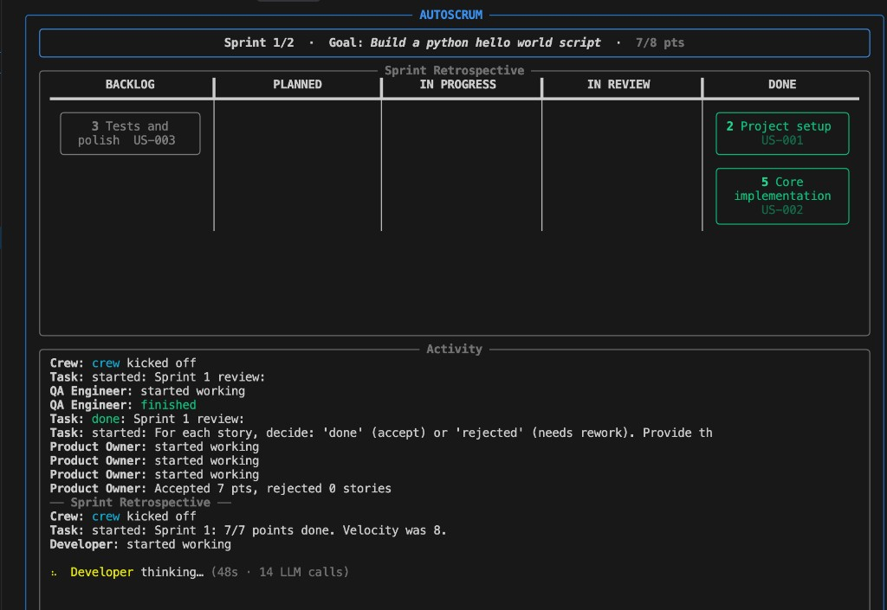

<p align="center">
  <h1 align="center">AutoScrum</h1>
  <p align="center">
    <strong>A self-organizing AI team that builds software using Scrum.</strong>
  </p>
  <p align="center">
    Give it a goal. Watch the sprints. Get the code.
  </p>
</p>

---

> [!WARNING]
> AutoScrum is in early development and should be considered a proof of concept.
> Expect rough edges, breaking changes, and LLM-dependent output quality.

AutoScrum turns a one-line project description into working software. It spins up
an AI-powered Scrum team — Product Owner, Scrum Master, Developers, QA — that
refines a backlog, plans sprints, writes code, reviews it, and retrospects. You
watch the whole process unfold on a live board in your terminal.

## Quick Start

```bash
uv sync
cp .env.example .env   # add your API key or local server URL
uv run autoscrum "Build a CLI calculator in Python"
```

AutoScrum will:

1. **Refine** the goal into user stories with acceptance criteria
2. **Estimate** story complexity (Fibonacci points)
3. **Plan** a sprint by prioritizing and selecting stories that fit the velocity
4. **Execute** — developers write real code to disk
5. **Review** — QA verifies acceptance criteria, PO accepts or rejects
6. **Retrospect** — the team reflects and adapts velocity

Repeat for as many sprints as configured. Output lands in a named directory under
`products/`, chosen by the Product Owner after requirements analysis.

## The Live Board

<p align="center">
  
</p>

Stories move across columns in real time. The right panel streams raw LLM output
as it's generated — reasoning and all — so you can see what the agents are
thinking.

## Configuration

### LLM (environment)

All agents share the same model by default. Set it once in `.env`:

```bash
AUTOSCRUM_LLM=openai/gpt-4o
OPENAI_API_KEY=sk-...
```

For a local server (oMLX, vLLM, Ollama, etc.):

```bash
AUTOSCRUM_LLM=openai/my-local-model
AUTOSCRUM_BASE_URL=http://myserver:8000/v1
OPENAI_API_KEY=not-needed
```

Any [LiteLLM-compatible](https://docs.litellm.ai/docs/providers) model string
works — cloud or local.

### Team (`team.yaml`)

The team file defines structure, not LLM settings. Override a specific role when
you want to run a different model for it:

```yaml
developer:
  count: 1

# Optional per-role override:
product_owner:
  llm: anthropic/claude-sonnet-4-20250514
```

### CLI

```
uv run autoscrum [OPTIONS] GOAL
```

| Option | Default | Description |
|---|---|---|
| `--team-config FILE` | `team.yaml` | Team configuration file. |
| `--sprint-duration MIN` | `5` | Time-box per sprint in minutes. |
| `--max-sprints N` | `3` | Number of sprints to run. |
| `--initial-velocity N` | `13` | Story points for sprint 1 (adjusts after each sprint). |
| `--output-dir DIR` | *(auto)* | Override the output directory. By default a name is chosen after backlog refinement. |
| `--no-code-execution` | off | Disable running code in Docker during testing/review. |
| `--verbose` | off | Show CrewAI internals alongside the board. |

## Pre-flight Check

Before the first sprint begins, AutoScrum verifies that every configured LLM is
reachable. If a connection fails the process exits immediately with a clear error
— no silent failures, no half-completed sprints.

## Why Scrum?

Most agent demos are single-shot: one prompt, one response. Real software
development is iterative. AutoScrum explores what happens when you give AI agents
a proven process framework instead of a blank canvas:

- **Structure reduces hallucination** — ceremonies constrain what each agent focuses on
- **Roles create accountability** — the PO doesn't write code, the developer doesn't prioritize
- **Time-boxing forces shipping** — incomplete work goes back to the backlog, not into an infinite loop
- **Retrospectives enable adaptation** — the team learns from each sprint

## Requirements

- Python 3.10 – 3.13
- [uv](https://docs.astral.sh/uv/)
- At least one LLM (cloud API key or local server)

## License

GPL-3.0
